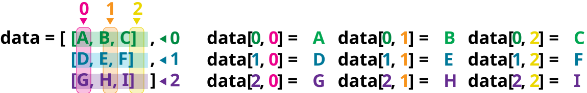
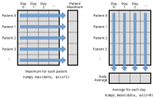

::::::::::::::::::::::::::::::::::::::: objectives

- Explain what a library is and what libraries are used for.
- Import a Python library and use the functions it contains.
- Read tabular data from a file into a program.
- Select individual values and subsections from data.
- Perform operations on arrays of data.

::::::::::::::::::::::::::::::::::::::::::::::::::

:::::::::::::::::::::::::::::::::::::::: questions

- How can I process tabular data files in Python?

::::::::::::::::::::::::::::::::::::::::::::::::::

Words are useful, but what's more useful are the sentences and stories we build with them.
Similarly, while a lot of powerful, general tools are built into Python,
specialized tools built up from these basic units live in
[libraries](../learners/reference.md#library)
that can be called upon when needed.

## Loading data into Python

To begin processing the naked mole-rat behaviour data, we need to load it into Python.
We can do that using a library called
[NumPy](https://numpy.org/doc/stable "NumPy Documentation"), which stands for Numerical Python.
In general, you should use this library when you want to do fancy things with lots of numbers,
especially if you have matrices or arrays. To tell Python that we'd like to start using NumPy,
we need to [import](../learners/reference.md#import) it:

```python
import numpy
```

Importing a library is like getting a piece of lab equipment out of a storage locker and setting it
up on the bench. Libraries provide additional functionality to the basic Python package, much like
a new piece of equipment adds functionality to a lab space. Just like in the lab, importing too
many libraries can sometimes complicate and slow down your programs - so we only import what we
need for each program.

Once we've imported the library, we can ask the library to read our data file for us:

```python
numpy.loadtxt(fname='../data/molerat_activity_v1.csv', delimiter=',') # note this assumes notebook lives in a notebook dir, same level as data dir, and needs `../data`
```

```output
array([[ 1.,  0.,  2., ...,  4.,  6.,  3.],
       [ 4.,  3.,  4., ...,  6.,  2.,  7.],
       [ 7.,  8.,  4., ...,  4.,  3.,  2.],
       ...,
       [12., 18., 11., ..., 19., 14., 12.],
       [ 6., 10., 10., ...,  9.,  8., 16.],
       [28., 27., 22., ..., 27., 23., 28.]], shape=(1000, 30))
```

The expression `numpy.loadtxt(...)` is a
[function call](../learners/reference.md#function-call)
that asks Python to run the [function](../learners/reference.md#function) `loadtxt` which
belongs to the `numpy` library.
The dot notation in Python is used most of all as an object attribute/property specifier or for invoking its method. `object.property` will give you the object.property value,
`object_name.method()` will invoke on object\_name method.

As an example, John Smith is the John that belongs to the Smith family.
We could use the dot notation to write his name `smith.john`,
just as `loadtxt` is a function that belongs to the `numpy` library.

`numpy.loadtxt` has two [parameters](../learners/reference.md#parameter): the name of the file
we want to read and the [delimiter](../learners/reference.md#delimiter) that separates values
on a line. These both need to be character strings
(or [strings](../learners/reference.md#string) for short), so we put them in quotes.

Since we haven't told it to do anything else with the function's output,
the [notebook](../learners/reference.md#notebook) displays it.
In this case,
that output is the data we just loaded.
By default,
only a few rows and columns are shown
(with `...` to omit elements when displaying big arrays).
Note that, to save space when displaying NumPy arrays, Python does not show us trailing zeros,
so `1.0` becomes `1.`.

Our call to `numpy.loadtxt` read our file
but didn't save the data in memory.
To do that,
we need to assign the array to a variable. In a similar manner to how we assign a single
value to a variable, we can also assign an array of values to a variable using the same syntax.
Let's re-run `numpy.loadtxt` and save the returned data:

```python
data = numpy.loadtxt(fname='../data/molerat_activity_v1.csv', delimiter=',')
```

This statement doesn't produce any output because we've assigned the output to the variable `data`.
If we want to check that the data have been loaded,
we can print the variable's value:

```python
print(data)
```

```output
[[ 1.  0.  2. ...  4.  6.  3.]
 [ 4.  3.  4. ...  6.  2.  7.]
 [ 7.  8.  4. ...  4.  3.  2.]
 ...
 [12. 18. 11. ... 19. 14. 12.]
 [ 6. 10. 10. ...  9.  8. 16.]
 [28. 27. 22. ... 27. 23. 28.]]
```

Now that the data are in memory,
we can manipulate them.
First,
let's ask what [type](../learners/reference.md#type) of thing `data` refers to:

```python
print(type(data))
```

```output
<class 'numpy.ndarray'>
```

The output tells us that `data` currently refers to
an N-dimensional array, the functionality for which is provided by the NumPy library.
These data correspond to mole-rat activity.
The rows are the individual mole-rats, and the columns
are their daily activity measurements.

:::::::::::::::::::::::::::::::::::::::::  callout

## Data Type

A Numpy array contains one or more elements
of the same type. The `type` function will only tell you that
a variable is a NumPy array but won't tell you the type of
thing inside the array.
We can find out the type
of the data contained in the NumPy array.

```python
print(data.dtype)
```

```output
float64
```

This tells us that the NumPy array's elements are
[floating-point numbers](../learners/reference.md#floating-point-number).


::::::::::::::::::::::::::::::::::::::::::::::::::

With the following command, we can see the array's [shape](../learners/reference.md#shape):

```python
print(data.shape)
```

```output
(1000, 30)
```

The output tells us that the `data` array variable contains 1000 rows and 30 columns. When we
created the variable `data` to store our arthritis data, we did not only create the array; we also
created information about the array, called [members](../learners/reference.md#member) or
attributes. This extra information describes `data` in the same way an adjective describes a noun.
`data.shape` is an attribute of `data` which describes the dimensions of `data`. We use the same
dotted notation for the attributes of variables that we use for the functions in libraries because
they have the same part-and-whole relationship.

If we want to get a single number from the array, we must provide an
[index](../learners/reference.md#index) in square brackets after the variable name, just as we
do in math when referring to an element of a matrix.  Our activity data has two dimensions, so
we will need to use two indices to refer to one specific value:

```python
print('first value in data:', data[0, 0])
```

```output
first value in data: 0.0
```

```python
print('middle value in data:', data[499, 14])
```

```output
middle value in data: 11.0
```

The expression `data[499, 14]` accesses the element at row 500, column 15. While this expression may
not surprise you,
`data[0, 0]` might.
Programming languages like Fortran, MATLAB and R start counting at 1
because that's what human beings have done for thousands of years.
Languages in the C family (including C++, Java, Perl, and Python) count from 0
because it represents an offset from the first value in the array (the second
value is offset by one index from the first value). This is closer to the way
that computers represent arrays (if you are interested in the historical
reasons behind counting indices from zero, you can read
[Mike Hoye's blog post](https://exple.tive.org/blarg/2013/10/22/citation-needed/)).
As a result,
if we have an M×N array in Python,
its indices go from 0 to M-1 on the first axis
and 0 to N-1 on the second.
It takes a bit of getting used to,
but one way to remember the rule is that
the index is how many steps we have to take from the start to get the item we want.

{alt="'data' is a 3 by 3 numpy array containing row 0: \['A', 'B', 'C'\], row 1: \['D', 'E', 'F'\], androw 2: \['G', 'H', 'I'\]. Starting in the upper left hand corner, data\[0, 0\] = 'A', data\[0, 1\] = 'B',data\[0, 2\] = 'C', data\[1, 0\] = 'D', data\[1, 1\] = 'E', data\[1, 2\] = 'F', data\[2, 0\] = 'G',data\[2, 1\] = 'H', and data\[2, 2\] = 'I', in the bottom right hand corner."}

:::::::::::::::::::::::::::::::::::::::::  callout

## In the Corner

What may also surprise you is that when Python displays an array,
it shows the element with index `[0, 0]` in the upper left corner
rather than the lower left.
This is consistent with the way mathematicians draw matrices
but different from the Cartesian coordinates.
The indices are (row, column) instead of (column, row) for the same reason,
which can be confusing when plotting data.


::::::::::::::::::::::::::::::::::::::::::::::::::

## Slicing data

An index like `[30, 20]` selects a single element of an array,
but we can select whole sections as well.
For example,
we can select the first ten days (columns) of values
for the first four mole-rats (rows) like this:

```python
print(data[0:4, 0:10])
```

```output
[[ 1.  0.  2.  3.  2.  4.  3.  4.  0.  4.]
 [ 4.  3.  4.  5.  4.  5.  6.  4.  6.  7.]
 [ 7.  8.  4.  7.  7.  4.  7.  6.  7.  8.]
 [ 4.  5.  6.  6.  7.  5. 12.  5.  6.  7.]]
```

The [slice](../learners/reference.md#slice) `0:4` means, "Start at index 0 and go up to,
but not including, index 4". Again, the up-to-but-not-including takes a bit of getting used to,
but the rule is that the difference between the upper and lower bounds is the number of values in
the slice.

We don't have to start slices at 0:

```python
print(data[5:10, 0:10])
```

```output
[[ 7.  3.  2.  8.  4.  4.  2.  3.  5.  3.]
 [ 8.  4.  4.  5.  4.  7.  6.  7.  6.  3.]
 [ 3.  4.  8.  7.  5.  4.  7.  6.  7.  5.]
 [ 4.  3.  3. 10.  7.  8.  7.  7.  3.  7.]
 [ 8.  5.  6.  3.  8. 11.  7.  4.  5.  3.]]
```

We also don't have to include the upper and lower bound on the slice.  If we don't include the lower
bound, Python uses 0 by default; if we don't include the upper, the slice runs to the end of the
axis, and if we don't include either (i.e., if we use ':' on its own), the slice includes
everything:

```python
small = data[:3, 26:]
print('small is:')
print(small)
```

The above example selects rows 0 through 2 and columns 26 through to the end of the array.

```output
small is:
[[2. 4. 6. 3.]
 [6. 6. 2. 7.]
 [4. 4. 3. 2.]]
```

## Analyzing data

NumPy has several useful functions that take an array as input to perform operations on its values.
If we want to find the average activity for all mole-rats on
all days, for example, we can ask NumPy to compute `data`'s mean value:

```python
print(numpy.mean(data))
```

```output
17.276233333333334
```

`mean` is a [function](../learners/reference.md#function) that takes
an array as an [argument](../learners/reference.md#argument).

:::::::::::::::::::::::::::::::::::::::::  callout

## Not All Functions Have Input

Generally, a function uses inputs to produce outputs.
However, some functions produce outputs without
needing any input. For example, checking the current time
doesn't require any input.

```python
import time
print(time.ctime())
```

```output
Sat Mar 26 13:07:33 2016
```

For functions that don't take in any arguments,
we still need parentheses (`()`)
to tell Python to go and do something for us.


::::::::::::::::::::::::::::::::::::::::::::::::::

Let's use three other NumPy functions to get some descriptive values about the dataset.
We'll also use multiple assignment,
a convenient Python feature that will enable us to do this all in one line.

```python
maxval, minval, stdval = numpy.max(data), numpy.min(data), numpy.std(data)

print('maximum activity:', maxval)
print('minimum activity:', minval)
print('standard deviation:', stdval)
```

Here we've assigned the return value from `numpy.max(data)` to the variable `maxval`, the value
from `numpy.min(data)` to `minval`, and so on.

```output
maximum activity: 49.0
minimum activity: 0.0
standard deviation: 7.769555659466991
```

:::::::::::::::::::::::::::::::::::::::::  callout

## Mystery Functions in IPython

How did we know what functions NumPy has and how to use them?
If you are working in IPython or in a Jupyter Notebook, there is an easy way to find out.
If you type the name of something followed by a dot, then you can use
[tab completion](../learners/reference.md#tab-completion)
(e.g. type `numpy.` and then press <kbd>Tab</kbd>)
to see a list of all functions and attributes that you can use. After selecting one, you
can also add a question mark (e.g. `numpy.cumprod?`), and IPython will return an
explanation of the method! This is the same as doing `help(numpy.cumprod)`.
Similarly, if you are using the "plain vanilla" Python interpreter, you can type `numpy.`
and press the <kbd>Tab</kbd> key twice for a listing of what is available. You can then use the
`help()` function to see an explanation of the function you're interested in,
for example: `help(numpy.cumprod)`.


::::::::::::::::::::::::::::::::::::::::::::::::::

When analyzing data, though,
we often want to look at variations in statistical values,
such as the maximum activity per mole-rat
or the average activity per day.
One way to do this is to create a new temporary array of the data we want,
then ask it to do the calculation:

```python
NMR_0 = data[0, :] # 0 on the first axis (rows), everything on the second (columns)
print('maximum activity for naked mole-rat 0:', numpy.max(NMR_0))
```

```output
maximum activity for naked mole-rat 0: 8.0
```

We don't actually need to store the row in a variable of its own.
Instead, we can combine the selection and the function call:

```python
print('maximum activity for naked mole-rat 2:', numpy.max(data[2, :]))
```

```output
maximum activity for naked mole-rat 2: 9.0
```

What if we need the maximum activity for each naked mole-rat over all days (as in the
next diagram on the left) or the average for each day (as in the
diagram on the right)? As the diagram below shows, we want to perform the
operation across an axis:

{alt="Per-mole-rat maximum activity is computed row-wise across all columns usingnumpy.max(data, axis=1). Per-day average activity is computed column-wise across all rows usingnumpy.mean(data, axis=0)."}

To find the **maximum activity reported for each mole-rat**, you would apply the `max` function moving across the columns (axis 1). To find the **daily average activity reported across mole-rats**, you would apply the `mean` function moving down the rows (axis 0).

To support this functionality, most array functions allow us to specify the axis we want to work on. If we ask for the maximum across axis 1 (columns in our 2D example), we get:

```python
print(numpy.max(data, axis=1))
```

```output
[ 8.  8.  9. 12. 12.  9. 12.  8. 10. 11.  9. 12. 12. 13.  9.  8. 11.  9.
  8.  9.  9.  9. 11. 10.  9. 10.  8. 11. 12. 14. 11.  8.  8. 12. 13. 13.
  8. 11. 11. 10. 10.  8.  9.  8. 11. 10.  7.  9. 11. 12. 13. 11.  7. 10.
 10.  9. 10.  9. 12. 11.  8. 14. 14.  9.  9. 12. 13.  9. 11. 10. 11.  9.
  9.  9. 11. 10. 10. 11.  8.  8. 10. 11. 12. 11.  9. 13. 10.  8.  9. 11.
 11. 10. 11.  9. 10. 11.  9.  9. 10. 10. 16. 19. 39. 25. 41. 32. 23. 38.
 32. 21. 32. 31. 13. 19. 18. 27. 30. 30. 31. 31. 35. 14. 18. 33. 19. 26.
 33. 19. 31. 31. 25. 41. 33. 31. 30. 37. 35. 23. 21. 27. 39. 31. 26. 21.
 25. 22. 24. 25. 21. 30. 31. 37. 21. 33. 19. 31. 18. 24. 32. 36. 36. 34.
 19. 28. 22. 23. 25. 27. 16. 15. 21. 35. 33. 32. 19. 33. 31. 24. 44. 31.
 36. 38. 20. 20. 19. 15. 31. 18. 32. 32. 21. 20. 33. 25. 31. 34. 20. 35.
 33. 21. 30. 21. 37. 31. 31. 22. 27. 29. 35. 34. 18. 20. 33. 33. 27. 28.
 34. 25. 39. 19. 39. 28. 29. 41. 14. 30. 31. 43. 19. 32. 34. 36. 35. 42.
 30. 38. 31. 43. 33. 30. 35. 34. 29. 17. 38. 44. 32. 37. 34. 27. 35. 35.
 30. 24. 31. 28. 18. 33. 35. 30. 29. 37. 34. 29. 37. 17. 21. 24. 27. 43.
 30. 16. 18. 33. 35. 31. 28. 36. 18. 21. 24. 21. 15. 35. 25. 29. 29. 21.
 34. 34. 34. 29. 19. 35. 29. 41. 16. 31. 41. 36. 36. 20. 23. 38. 26. 28.
 33. 28. 42. 38. 30. 35. 28. 30. 31. 27. 29. 26. 21. 27. 20. 28. 31. 16.
 22. 38. 29. 22. 33. 22. 34. 27. 17. 32. 21. 40. 34. 36. 29. 39. 21. 22.
 36. 30. 43. 24. 31. 40. 23. 29. 18. 32. 30. 23. 23. 18. 30. 34. 22. 30.
 17. 33. 32. 35. 23. 35. 30. 38. 32. 23. 16. 21. 32. 32. 21. 18. 26. 30.
 21. 20. 23. 26. 31. 33. 24. 21. 16. 21. 18. 18. 21. 20. 32. 29. 26. 32.
 25. 33. 38. 19. 34. 26. 22. 28. 18. 21. 26. 29. 19. 22. 27. 44. 27. 32.
 22. 33. 39. 37. 21. 26. 20. 19. 39. 30. 30. 20. 24. 34. 22. 35. 27. 34.
 20. 27. 32. 31. 33. 18. 27. 42. 17. 24. 39. 21. 16. 30. 20. 27. 28. 19.
 30. 41. 31. 30. 19. 17. 28. 19. 38. 35. 18. 33. 19. 35. 24. 16. 20. 22.
 34. 30. 21. 30. 31. 35. 19. 21. 22. 43. 35. 21. 19. 22. 36. 31. 30. 31.
 22. 20. 22. 35. 31. 34. 32. 19. 20. 29. 20. 38. 17. 18. 30. 34. 29. 18.
 30. 35. 35. 23. 21. 26. 37. 31. 36. 35. 18. 18. 33. 18. 37. 34. 34. 23.
 20. 34. 35. 31. 24. 22. 36. 28. 28. 35. 30. 35. 19. 22. 31. 18. 22. 36.
 28. 37. 27. 44. 25. 33. 34. 39. 22. 36. 34. 38. 29. 20. 35. 27. 34. 22.
 30. 35. 24. 36. 32. 35. 35. 16. 18. 22. 33. 36. 15. 32. 27. 28. 31. 20.
 31. 29. 22. 37. 33. 24. 31. 19. 35. 20. 24. 20. 33. 32. 34. 40. 36. 32.
 25. 18. 28. 38. 35. 19. 25. 27. 33. 28. 32. 36. 34. 28. 29. 38. 28. 37.
 38. 28. 31. 16. 25. 18. 20. 31. 36. 25. 35. 25. 25. 37. 33. 32. 40. 27.
 33. 49. 21. 38. 26. 36. 34. 21. 22. 18. 33. 32. 29. 36. 33. 29. 28. 19.
 27. 23. 31. 29. 29. 29. 20. 30. 26. 33. 33. 32. 35. 18. 36. 33. 28. 36.
 18. 32. 33. 30. 27. 17. 36. 21. 19. 18. 33. 29. 37. 29. 34. 20. 30. 24.
 32. 36. 35. 24. 32. 33. 21. 36. 20. 16. 40. 33. 25. 34. 15. 36. 16. 28.
 20. 38. 36. 18. 40. 37. 38. 31. 35. 27. 39. 38. 44. 39. 20. 19. 28. 19.
 29. 21. 21. 33. 36. 42. 36. 18. 41. 21. 38. 19. 18. 21. 19. 27. 31. 19.
 32. 33. 40. 35. 34. 16. 20. 20. 37. 33. 16. 36. 35. 33. 40. 36. 31. 17.
 29. 39. 32. 21. 14. 26. 20. 17. 16. 33. 41. 37. 34. 31. 26. 21. 20. 13.
 37. 37. 32. 35. 21. 34. 27. 21. 38. 18. 18. 31. 18. 17. 33. 37. 37. 32.
 32. 34. 21. 40. 32. 40. 32. 37. 33. 29. 28. 26. 33. 35. 40. 30. 23. 33.
 17. 28. 20. 19. 28. 34. 17. 38. 20. 38. 38. 21. 37. 16. 39. 37. 21. 44.
 29. 30. 37. 16. 38. 30. 23. 29. 37. 18. 19. 35. 29. 21. 26. 17. 13. 39.
 26. 15. 28. 29. 30. 42. 21. 30. 19. 21. 23. 36. 28. 42. 40. 24. 32. 24.
 32. 30. 20. 34. 35. 29. 21. 33. 31. 17. 28. 15. 29. 19. 25. 23. 36. 22.
 31. 32. 28. 18. 30. 35. 33. 33. 38. 34. 20. 32. 42. 40. 29. 26. 19. 18.
 36. 24. 20. 34. 26. 29. 38. 31. 32. 16. 33. 31. 34. 32. 33. 33. 37. 34.
 29. 33. 32. 26. 20. 16. 35. 42. 29. 34. 34. 44. 25. 26. 20. 19. 20. 24.
 20. 33. 25. 33. 20. 28. 25. 32. 31. 27. 22. 36. 27. 17. 33. 32. 29. 20.
 35. 31. 26. 32. 28. 36. 36. 27. 40. 29. 31. 31. 16. 39. 34. 32. 32. 18.
 22. 30. 40. 34. 23. 31. 31. 26. 33. 31. 27. 32. 33. 18. 33. 30. 15. 15.
 19. 37. 33. 29. 19. 33. 32. 21. 21. 34.]

```

As a quick check, we can ask this array what its shape is. We expect 1000 mole-rat maxima:

```python
print(numpy.max(data, axis=1).shape)
```

```output
(1000,)
```

The expression `(1000,)` tells us we have an N×1 vector, so this is the maximum activity per day for each mole-rat. 

If we ask for the average across/down axis 0 (rows in our 2D example), we get:

```python
print(numpy.mean(data, axis=0))
```

```output
[15.849 14.754 16.455 17.93  16.196 16.743 17.364 17.346 15.849 17.121
 18.689 18.196 17.687 17.083 19.602 19.974 16.125 16.474 16.574 18.281
 17.178 16.746 19.903 18.174 16.155 17.197 17.095 19.392 14.996 17.159]
```

Check the array shape. We expect 30 averages, one for each day of the study:

```python
print(numpy.mean(data, axis=0).shape)
```

```output
(30,)
```
Similarly, we can apply the `mean` function to axis 1 to get the mole-rat's average activity over the duration of the study (1000 values). 

```python
print(numpy.mean(data, axis=1))
```
```output
[ 3.4         4.8         5.53333333  6.          4.4         4.36666667
  4.93333333  4.73333333  5.83333333  6.36666667  4.36666667  5.73333333
  5.86666667  4.6         5.13333333  4.2         4.06666667  4.23333333
  5.          4.63333333  4.5         4.83333333  4.8         5.96666667
  4.53333333  4.7         4.33333333  4.43333333  4.86666667  7.06666667
  4.96666667  5.1         4.          4.33333333  5.53333333  5.66666667
  3.73333333  5.93333333  5.76666667  4.33333333  4.76666667  3.53333333
  4.43333333  5.03333333  5.5         6.06666667  3.73333333  4.33333333
  5.16666667  6.23333333  5.86666667  4.33333333  3.7         4.66666667
  4.5         5.86666667  5.4         5.1         4.5         4.26666667
  3.96666667  5.76666667  5.73333333  4.          4.7         4.73333333
  4.76666667  4.23333333  4.8         6.1         5.86666667  4.86666667
  5.2         4.36666667  5.96666667  4.3         4.63333333  5.53333333
  3.96666667  5.          4.46666667  3.93333333  5.56666667  5.56666667
  3.96666667  6.2         5.46666667  4.36666667  5.56666667  4.8
  4.46666667  4.56666667  5.23333333  4.86666667  5.53333333  5.7
  4.03333333  4.86666667  5.03333333  5.03333333 10.3        13.26666667
 25.23333333 17.7        26.23333333 21.06666667 11.73333333 21.1
 22.06666667 14.13333333 23.7        17.96666667  8.36666667 11.53333333
 10.5        19.5        20.26666667 20.7        19.8        21.
 23.76666667  9.36666667 10.23333333 20.96666667 12.93333333 17.06666667
 18.33333333 11.36666667 21.3        18.76666667 13.96666667 22.13333333
 20.03333333 20.9        21.4        21.26666667 23.26666667 12.36666667
 11.1        19.13333333 25.53333333 21.03333333 14.56666667 12.1
 16.4        12.56666667 17.9        16.03333333 11.96666667 20.06666667
...
 20.93333333 17.9        19.         19.83333333 19.23333333 23.13333333
 22.36666667 11.5        21.33333333 19.4         8.9         9.86666667
 10.06666667 26.46666667 14.13333333 21.93333333 13.06666667 26.73333333
 23.93333333 14.2        12.83333333 24.56666667]
```

:::::::::::::::::::::::::::::::::::::::  challenge

## Slicing Strings

A section of an array is called a [slice](../learners/reference.md#slice).
We can take slices of character strings as well:

```python
element = 'oxygen'
print('first three characters:', element[0:3])
print('last three characters:', element[3:6])
```

```output
first three characters: oxy
last three characters: gen
```

What is the value of `element[:4]`?
What about `element[4:]`?
Or `element[:]`?

:::::::::::::::  solution

## Solution

```output
oxyg
en
oxygen
```

:::::::::::::::::::::::::

What is `element[-1]`?
What is `element[-2]`?

:::::::::::::::  solution

## Solution

```output
n
e
```

:::::::::::::::::::::::::

Given those answers,
explain what `element[1:-1]` does.

:::::::::::::::  solution

## Solution

Creates a substring from index 1 up to (not including) the final index,
effectively removing the first and last letters from 'oxygen'


:::::::::::::::::::::::::

How can we rewrite the slice for getting the last three characters of `element`,
so that it works even if we assign a different string to `element`?
Test your solution with the following strings: `carpentry`, `clone`, `hi`.

:::::::::::::::  solution

## Solution

```python
element = 'oxygen'
print('last three characters:', element[-3:])
element = 'carpentry'
print('last three characters:', element[-3:])
element = 'clone'
print('last three characters:', element[-3:])
element = 'hi'
print('last three characters:', element[-3:])
```

```output
last three characters: gen
last three characters: try
last three characters: one
last three characters: hi
```

:::::::::::::::::::::::::

::::::::::::::::::::::::::::::::::::::::::::::::::

:::::::::::::::::::::::::::::::::::::::  challenge

## Thin Slices

The expression `element[3:3]` produces an
[empty string](../learners/reference.md#empty-string),
i.e., a string that contains no characters.
If `data` holds our array of mole-rat data,
what does `data[3:3, 4:4]` produce?
What about `data[3:3, :]`?

:::::::::::::::  solution

## Solution

```output
array([], shape=(0, 0), dtype=float64)
array([], shape=(0, 40), dtype=float64)
```

:::::::::::::::::::::::::

::::::::::::::::::::::::::::::::::::::::::::::::::

:::::::::::::::::::::::::::::::::::::::  challenge

## Stacking Arrays

Arrays can be concatenated and stacked on top of one another,
using NumPy's `vstack` and `hstack` functions for vertical and horizontal stacking, respectively.

```python
import numpy

A = numpy.array([[1, 2, 3], [4, 5, 6], [7, 8, 9]])
print('A = ')
print(A)

B = numpy.hstack([A, A])
print('B = ')
print(B)

C = numpy.vstack([A, A])
print('C = ')
print(C)
```

```output
A =
[[1 2 3]
 [4 5 6]
 [7 8 9]]
B =
[[1 2 3 1 2 3]
 [4 5 6 4 5 6]
 [7 8 9 7 8 9]]
C =
[[1 2 3]
 [4 5 6]
 [7 8 9]
 [1 2 3]
 [4 5 6]
 [7 8 9]]
```

Write some additional code that slices the first and last columns of `A`,
and stacks them into a 3x2 array.
Make sure to `print` the results to verify your solution.

:::::::::::::::  solution

## Solution

A 'gotcha' with array indexing is that singleton dimensions
are dropped by default. That means `A[:, 0]` is a one dimensional
array, which won't stack as desired. To preserve singleton dimensions,
the index itself can be a slice or array. For example, `A[:, :1]` returns
a two dimensional array with one singleton dimension (i.e. a column
vector).

```python
D = numpy.hstack((A[:, :1], A[:, -1:]))
print('D = ')
print(D)
```

```output
D =
[[1 3]
 [4 6]
 [7 9]]
```

:::::::::::::::::::::::::

:::::::::::::::  solution

## Solution

An alternative way to achieve the same result is to use Numpy's
delete function to remove the second column of A. If you're not
sure what the parameters of numpy.delete mean, use the help files.

```python
D = numpy.delete(arr=A, obj=1, axis=1)
print('D = ')
print(D)
```

```output
D =
[[1 3]
 [4 6]
 [7 9]]
```

:::::::::::::::::::::::::

::::::::::::::::::::::::::::::::::::::::::::::::::

:::::::::::::::::::::::::::::::::::::::  challenge

## Change In Behaviour

The mole-rat data is *longitudinal* in the sense that each row represents a
series of observations relating to one individual.  This means that
the change in activity over time is a meaningful concept.
Let's find out how to calculate changes in the data contained in an array
with NumPy.

The `numpy.diff()` function takes an array and returns the differences
between two successive values. Let's use it to examine the changes
each day across the first week of mole-rat 3 from our activity dataset.

```python
NMR3_week1 = data[3, :7]
print(NMR3_week1)
```

```output
[ 4.  5.  6.  6.  7.  5. 12.]
```

Calling `numpy.diff(NMR3_week1)` would do the following calculations

```python
[ 4 - 0, 5 - 4, 6 - 5, 6 - 6, 7 - 6, 5 - 7, 12 - 5 ]
```

and return the 6 difference values in a new array.

```python
numpy.diff(NMR3_week1)
```

```output
array([ 1.,  1.,  0.,  1., -2.,  7.])
```

Note that the array of differences is shorter by one element (length 6).

When calling `numpy.diff` with a multi-dimensional array, an `axis` argument may
be passed to the function to specify which axis to process. When applying
`numpy.diff` to our 2D activity array `data`, which axis would we specify?

:::::::::::::::  solution

## Solution

Since the row axis (0) is mole-rat, it does not make sense to get the
difference between two arbitrary mole-rat. The column axis (1) is in
days, so the difference is the change in activity -- a meaningful
concept.

```python
numpy.diff(data, axis=1)
```

:::::::::::::::::::::::::

If the shape of an individual data file is `(60, 40)` (60 rows and 40
columns), what would the shape of the array be after you run the `diff()`
function and why?

:::::::::::::::  solution

## Solution

The shape will be `(60, 39)` because there is one fewer difference between
columns than there are columns in the data.


:::::::::::::::::::::::::

How would you find the largest change in activity for each mole-rat? Does
it matter if the change in activity is an increase or a decrease?

:::::::::::::::  solution

## Solution

By using the `numpy.max()` function after you apply the `numpy.diff()`
function, you will get the largest difference between days.

```python
numpy.max(numpy.diff(data, axis=1), axis=1)
```

```python
array([  7.,  12.,  11.,  10.,  11.,  13.,  10.,   8.,  10.,  10.,   7.,
         7.,  13.,   7.,  10.,  10.,   8.,  10.,   9.,  10.,  13.,   7.,
        12.,   9.,  12.,  11.,  10.,  10.,   7.,  10.,  11.,  10.,   8.,
        11.,  12.,  10.,   9.,  10.,  13.,  10.,   7.,   7.,  10.,  13.,
        12.,   8.,   8.,  10.,  10.,   9.,   8.,  13.,  10.,   7.,  10.,
         8.,  12.,  10.,   7.,  12.])
```

If activity values *decrease* along an axis, then the difference from
one element to the next will be negative. If
you are interested in the **magnitude** of the change and not the
direction, the `numpy.absolute()` function will provide that.

Notice the difference if you get the largest *absolute* difference
between readings.

```python
numpy.max(numpy.absolute(numpy.diff(data, axis=1)), axis=1)
```

```python
array([ 7.,  5.,  6., 10.,  8.,  6.,  9.,  5.,  7.,  6.,  6.,  8.,  9.,
        8.,  6.,  8.,  6.,  7.,  5.,  7.,  6.,  5.,  8.,  7.,  7.,  5.,
        4.,  7., 10.,  8.,  8.,  5.,  7., 10.,  9.,  8.,  6.,  6.,  5.,
        7.,  8.,  5.,  5.,  6.,  9.,  9.,  5.,  7.,  8.,  9., 10.,  9.,
        5.,  9.,  7.,  5.,  6.,  5.,  7.,  9.,  6., 10., 10.,  8.,  7.,
       10.,  8.,  5.,  9.,  6.,  5.,  5.,  7.,  9.,  8.,  7., 10.,  7.,
        7.,  5.,  6.,  9.,  9.,  9.,  8.,  9.,  9.,  6.,  7.,  8.,  9.,
        8., 11.,  7.,  9.,  7.,  9.,  6.,  7.,  7., 10.,  8., 17., 17.,
       16., 11., 17., 22., 14., 13., 18., 16.,  9., 13.,  9., 13., 15.,
       14., 16., 13., 17., 10., 12., 18., 15., 14., 24., 13., 18., 15.,
       12., 26., 20., 15., 14., 20., 22., 19., 10., 12., 22., 14., 12.,
       14., 12., 15., 11., 12., 12., 13., 20., 19.,  8., 14., 11., 15.,
        9., 11., 15., 22., 18., 15., 10., 12., 14., 15., 19., 15.,  8.,
        7., 14., 20., 15., 20., 10., 13., 13., 10., 17., 13., 19., 16.,
       11., 11., 11.,  9., 15.,  9., 22., 15.,  8., 11., 13., 10., 14.,
       16., 14., 26., 14., 12., 14., 10., 17., 11., 16., 17., 10., 14.,
       21., 15., 11., 11., 15., 14., 16., 14., 22., 13., 19., 10., 11.,
       15., 17., 14.,  7., 21., 12., 18., 11., 21., 18., 18., 19., 15.,
       14., 19., 13., 19., 14., 13., 14., 15., 11., 12., 13., 20., 17.,
       15., 16., 12., 17., 19., 13., 15., 15., 15., 10., 13., 17., 19.,
       13., 12., 15., 14., 20.,  9., 11.,  8., 13., 11., 14., 10., 10.,
       15., 22., 14., 15., 17.,  9., 12., 13., 12.,  7., 17., 14., 12.,
       25., 12., 15., 16., 11., 14., 10., 18., 14., 17., 12., 23., 20.,
       12., 17., 10., 11., 22., 13., 14., 17., 13., 19., 20., 16., 17.,
       12., 11., 13., 17., 20., 11., 13., 17., 13., 16., 13.,  8., 12.,
...
       14., 22., 12., 18., 14., 14., 15., 14., 14., 12., 11., 21., 12.,
       11., 11., 12., 16., 12., 17., 13., 12., 12., 14., 15., 18., 12.,
       19., 14., 14.,  8.,  9., 17., 15., 13., 14.,  9., 18., 13., 21.,
       14., 13., 11., 13., 15., 18., 16., 11., 18., 16., 11., 13., 14.,
        6.,  8., 12., 18., 23., 14., 10., 12., 13.,  7., 11., 19.])
```

:::::::::::::::::::::::::

::::::::::::::::::::::::::::::::::::::::::::::::::


:::::::::::::::::::::::::::::::::::::::: keypoints

- Import a library into a program using `import libraryname`.
- Use the `numpy` library to work with arrays in Python.
- The expression `array.shape` gives the shape of an array.
- Use `array[x, y]` to select a single element from a 2D array.
- Array indices start at 0, not 1.
- Use `low:high` to specify a `slice` that includes the indices from `low` to `high-1`.
- Use `# some kind of explanation` to add comments to programs.
- Use `numpy.mean(array)`, `numpy.max(array)`, and `numpy.min(array)` to calculate simple statistics.
- Use `numpy.mean(array, axis=0)` or `numpy.mean(array, axis=1)` to calculate statistics across the specified axis.

::::::::::::::::::::::::::::::::::::::::::::::::::


